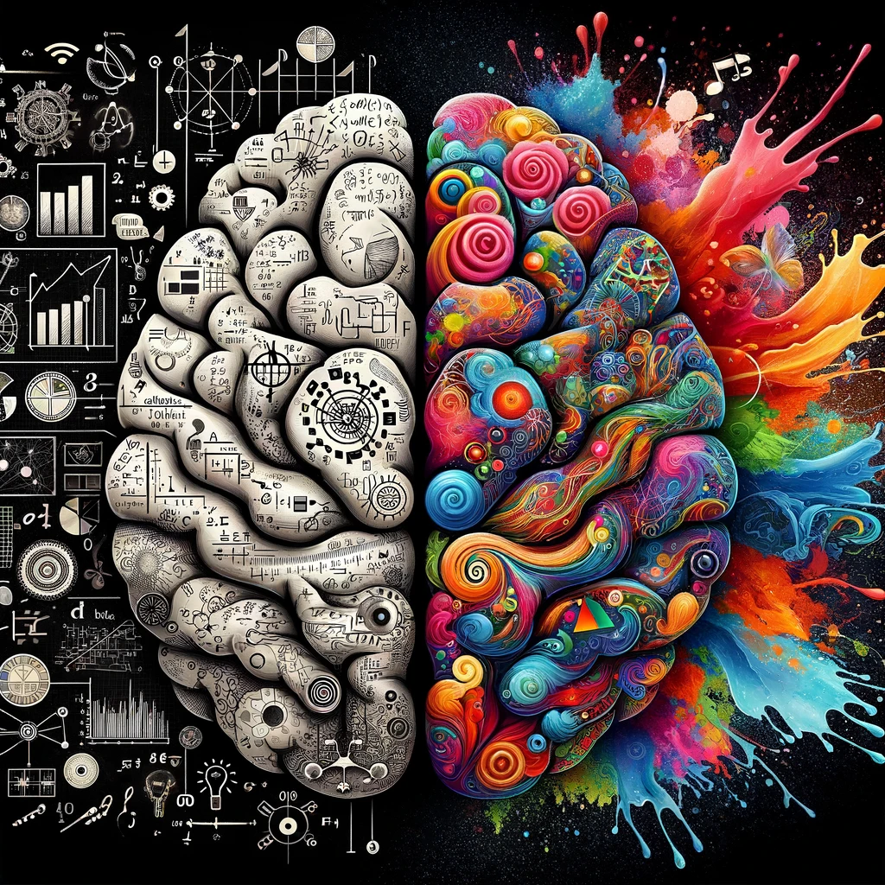
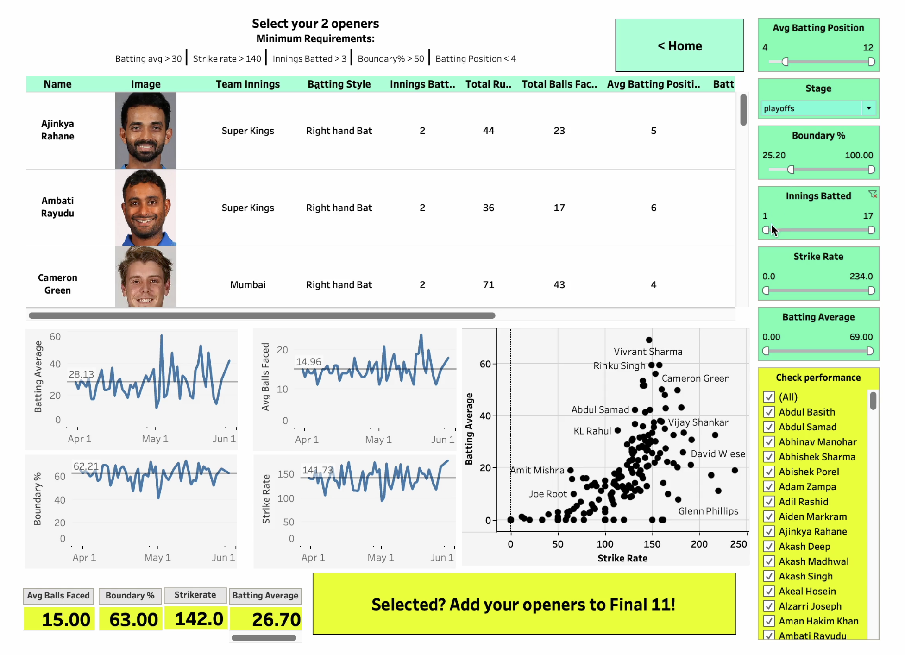

# About Me

 
**"I love art. I love data. How could I not love the art of data science?"**

I'm a passionate data science enhusiast always on the hunt for the next exciting problem to solve. I aspire to a role that fulfills my innate desire to solve impactful problems of the world. I work hard and don't stop till I achieve what I've set out to. I'm on a constant journey of self-improvement, and firmly beleive in adding value to the team I'm a part of. 

If that sounds like something that interests you, shoot me an email at ssingh45@usc.edu or connect with me on [LinkedIn](https://www.linkedin.com/in/shikharsingh167/), and maybe we can solve the next big problem together!  

# Education						       		
- M.S, CS | University of Southern California, Los Angeles (_Dec 2024_)	 			        		
- B.Tech, CSE | Vellore Institute of Technology, Vellore  (_Sept 2020_)

# Work Experience
**Business Systems Analyst @ Wolters Kluwer (_Jan 2020 - Dec 2022_)**
- Created an interactive analytics tool in Splunk that mined real-time app logs and described 15+ use-cases
- Diagnosed production issues and aided incident management using Splunk and MySQL over 28 monthly sprints
- Defined detailed requirements for 25+ use-cases as a product specialist, serving 58 US jurisdictions
- Partnered with solution architects to design a multi-cloud DR strategy in AWS/Azure, impacting 74k users
- Crafted the integration of virus detection workflow into a web application, achieving 35 uploaded-file-scans/minute
- Revised 35+ use-cases for a web app to sustain an influx of 115k new users through an extensive GAP analysis

**Data Science Intern @ Mphasis Limited (_May 2019 - June 2019_)**
- Conducted extensive research on process mining in R, experimenting on 500K rows of in-patient activity data
- Proposed Graph DB as an effective store for join-intensive activity data, to accelerate response times by 50%
- Implemented a POC in the NeO4j GraphDB, generating mined process graph and improving query times by 20%
- Optimized query performance using CypherQL to improve 15 methods of unearthing KPIs, enhancing readability
- Refined process graph visualization using vis.js with 3 adaptive KPI indicators and animated edge traversal
- Applied Random Forest on healthcare data to predict users’ next activity in the journey with an accuracy of 70%
  

# Projects
## MediumGEN - "Medium" Style Articles using Large Language Models

[Link to project](https://github.com/rs2309/MediumGEN)
- Fine tuned GPT 2 and LLAMA 2 using Low Rank Adaption (LoRA) on a dataset of 200K Medium Articles
- Devised a weighted scoring mechanism, to assess coherence, tone, accuracy and writing style on a 10-pt scale
- Experimented with prompting techniques to outscore baseline models by 15% across 40 generated articles  

## IPL2024 - Data Driven Player Selector Portal

[Link to youtube demo](https://www.youtube.com/watch?v=7YkEAGLmHzQ&t=2s&ab_channel=ShikharSingh)
- Crafted a BeautifulSoup web-scraper for automated IPL 2023 data collection from 10 teams and 74 matches
- Processed, cleaned, and transformed data using Pandas and identified 8 KPIs to evaluate player performance
- Curated Best XI from player stats using 8 extracted KPIs, showcased on an interactive Tableau dashboard  

## MarsFROST - Frost Identification on Mars using CNN

[Link to project](https://github.com/Shikhar167/USC/tree/main/Frost%20Detection%20using%20CNN)
- Trained a 3-layer CNN + MLP architecture on 214 HiRISE subframe images (5120*5120 px) of Martian terrain
- Deployed various data augmentation and processing techniques to achieve a test macro avg f1-score of 92%  

## Skin Cancer Detection using K-Means

[Link to project](https://github.com/Shikhar167/Projects_VIT_Vellore/blob/master/Academic_Projects/Skin%20Cancer%20Detection%20using%20K-Means%20Algorithm/Project%20Report%20Image%20Processing.pdf)
- Built a model to process skin lesion images and determine if they are cancerous by evaluating physical characteristics
- Used median filtering, clustering, edge detection techniques in MATLAB to deduce results with 92% accuracy  

## Sentiment Analysis of Amazon Customer Review Data

[Link to project](https://github.com/Shikhar167/USC/tree/main/Amazon%20Review%20Sentiment%20Analysis)
- Analyzed, cleaned, and pre-processed 2,000,000 records of Amazon customer review data in Python to prepare sample dataset
- Performed binary sentiment classification, achieving an accuracy of 89% by fine-tuning machine learning models  

## Predicting Future Energy Consumption – Time Series Forecasting

[Link to project](https://github.com/Shikhar167/USC/tree/main/Time%20Series%20Forecasting%20-%20Energy%20Consumption)
- Performed time series analysis on 16 years of PJM Interconnection East region Energy Consumption data measured in MW
- Extracted features & calculated importance using an XGBoost model. Predicted future energy consumption with 86% accuracy  

# Publication
## Human Computer Interaction analysis on Game Developed in Python using Gesture Recognition
[Publication](https://www.ijert.org/research/human-computer-interaction-game-developed-in-python-using-gesture-recognition-IJERTV8IS110227.pdf)
- Conducted a comprehensive GUI evaluation of an interactive game developed in Python using Gesture Recognition techniques
- Evaluated Nielsen’s heuristics and conducted trials across age groups to study cognitive ability based on game performance  

# Awards, Honors and Accolades
## Merit Scholarship | VIT Vellore
[View Credential](https://github.com/Shikhar167/Research-Projects-and-Awards/blob/master/Accolades/Shikhar%20Singh%20-%20Merit%20Scholarship.pdf)
- Rewarded scholarship across 4 years of UG study in recognition of VITEEE’16 rank (top 3.5%) and excellent academic performance

## Chairman’s Award | Wolters Kluwer
[View Credential](https://github.com/Shikhar167/Research-Projects-and-Awards/blob/master/Accolades/GIA%20win%20cred.png)
- Received the prestigious enterprise-wide Chairman's Award for digital transformation of a critical application during the pandemic
  

# Technical Skills

### Languages
- Python, R, JavaScript, SQL, CypherQL, MATLAB, HTML/CSS, Search Processing Language

### Libraries
- Pandas, NumPy, Matplotlib, Seaborn, Scikit-Learn, NLTK, Torch, TensorFlow, Image

### Frameworks and Tools
- PyTorch, AWS, Tableau, Splunk, Git, Huggingface, VS Code, JIRA, LucidChart

### Databases
- MySQL, PostgreSQL, NeO4j, Snowflake
